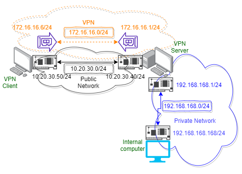

# its454

Course materials and demos for labs.

## Lab12: Virutal Private Network

_Description_

Setup and configure virtual private network.

_Steps_

1. Configure network topology
2. Setup and configure OpenVPN server on Ubuntu
3. Setup and configure OpenVPN client on Windows
4. Setup and configure OpenVPN client on EXTERNAL SEED (Optional, you may follow the reference to complete this). You need another SEED serves as an external SEED, such as SEED2.

Demo video:
* [Setup and configure a vpn with openvpn on ubuntu 18.04 and windows server 2019](https://youtu.be/CLb9ymU8l0A)
* [Setup vpnclient on Ubuntu 16.04](https://youtu.be/FB46aqxEkBI)

_References_
* [How To Set Up an OpenVPN Server on Ubuntu 18.04](https://www.digitalocean.com/community/tutorials/how-to-set-up-an-openvpn-server-on-ubuntu-18-04)

